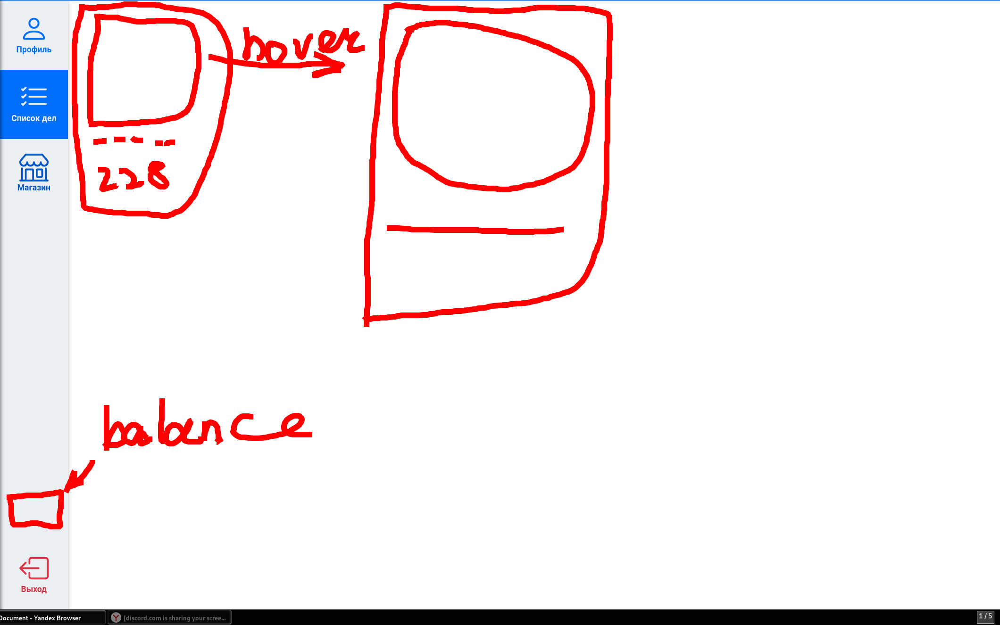
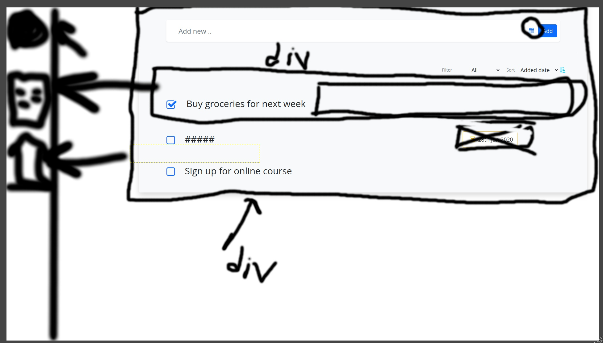
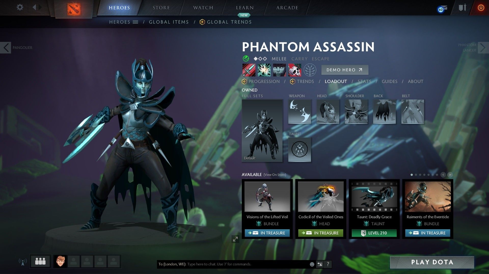

# Техническое задание

Техническое задание на разработку проекта.

# Цель проекта

Цель проекта --- разработать web-сервис: TODO-лист с дополнительной мотивацией,
выполненной в игровой форме.  Пользователь сможет ввести в системе
личный список дел (TODO-лист). Дополнительную мотивированность выполнять
поставленные задачи обеспечат игровые элементы.

# Описание системы

Система состоит из следующих основных функциональных блоков:

1. Регистрация, аутентификация и авторизация
2. Функционал ведения TODO-листа
3. Функционал кастомизации персонажa
4. Магазин внутриигровых предметов
5. ...

## Регистрация

Предполагается регистрация по email. Должна быть возможность восстановить пароль
с помощью ссылки из письма на электронную почту.

Также, в дальнейшем предполагается адаптация системы под самостоятельный деплой
на своем сервере. В рамках этого, необходимо реализовать управление аккаунтами
пользователей через учетную запись с правами администратора, или управление
аккаунтами через cli-интерфейс сервера API.

При регистрации, должны быть запрошены следующие поля:

- email --- обязательное поле
- пароль --- обязательное поле
- никнейм --- обязательное поле

## Аутентификация

Аутентификация происходит по email/никнейму, с указанием пароля. Также, должна
быть реализована поддержка двухфакторной аутентификации с помощью одноразового
пароля, генерируемого в приложении на телефоне.

## Функционал TODO-листа

После аутентификации пользователь попадает на страницу TODO-листа. Функционал
этой страницы состоит из следующих блоков:

1. Список задач
2. Задача содержит следующие данные:
   - Название задачи
   - Описание задачи
   - Дата создания задачи
   - Дедлайн задачи
   - Анекдот про Штирлица
   - У задачи могут быть теги - `label`'ы
   - Могут быть файловые вложения
   - Так же описание может быть написано в формате `markdown`.

За выполнение задач начисляются бонусы.

## Кастомизация персонажа

Предполагается отдельная страница для кастомизации персонажа. Эта страница
должна включать в себя:

- фигурку персонажа, с текущими элементами кастомизации;
- характеристики персонажа;
- инвентарь.

Кастомизация персонажа осуществляется путем его экипировки различными предметами
из инвентаря.

## Магазин внутриигровых предметов

Магазин должен быть реализован в схожем с инвентарем формате. Здесь пользователь сможет покупать предметы кастомизации персонажа и кейсы с предметами за игровую валюту.

### Предметы в магазине имеют следующие свойства
- картинка предпросмотра предмета
- png изображение скина для визуализации на персонаже либо 3D модель(например - `Demons eater` из Dota 2)
- стоимость предмета
- Редкость предмета
- название предмета

## Профиль

В профиле отображается текущая моделька персонажа, описание персонажа,
статистика персонажа, баланс внутриигровой валюты, баланс банковской карты и предложение оформить рассрочку на 5 лет на донат.

## Редактирование профиля

В этом разделе у пользователя есть возможность редактировать данные своего
профиля --- email, никнейм, смена пароля, управление двухфакторной
аутентификацией, изменение изображения профиля: либо из предложенных картинок, либо загруженная своя.

## Бонусы 
### Накопительная система:

За ежедненвный вход пользователь получает:

`к` - коэффициент, который умножается на баллы, полученные за задачу
+ 1 день: к = 1
+ 2 день: к = 1.1
+ 3 день: к = 1.2
  ...
+ 7 день: к = 1.6
  Теперь счет по неделям
+ 14 день: к = 1.7
...
+ 21 день: k = 1.8
+ 28 день: k = 1.9
+ 35 день - финал: k = 2

Храним в беке:
- стрик из дней

# Требования к дизайну

Проект должен поддерживать переключение между темной и светлой темой оформления.

Акцентный цвет - синий ($primary в `bootstrap`)е
## Концепт магазина

## Концепт списка дел

## Референсы списка дел

- https://vikunja.cloud/

## Концепт меню кастомизации персонажа

В нижней части страницы (в подвале) должно быть написано:
> «Работает на Open Source» со ссылкой на GitHub проекта.
